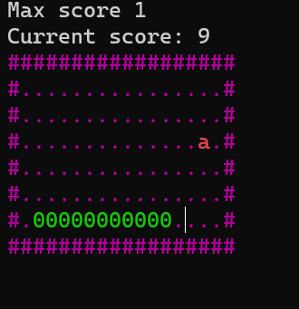
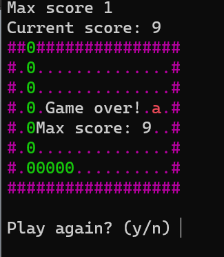
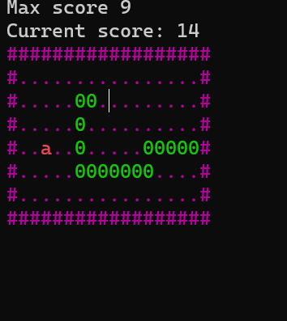

# SnakeConsoleGame
The snake game in Windows console using WinAPI.
<br>

## About the project
This project is made as a study one and from the same series as the previous one, located in the GuessTheWordGame repository. The link to it is below.

[](https://github.com/xImDoctor/GuessTheWordGame) 
<br><br>

## Something about the code and project
This project uses ```.wav``` audio files. You can read how to use it <a href="snakeByMethods/sound"> right here</a>. The project made using functional programming and there are comments on the entire code.<br>
There are also unused sounds in that folder, this is due to the peculiarities of ```PlaySound()```, in order to use sounds in parallel I guess you need to use a threading.

## A brief overview of the game
The idea of the game is to recreate the Snake using the tools of the Windows console, in particular the methods of changing the cursor position to redraw chars, interact with the keyboard keys, change colors and play music and sounds.
There are some screenshots of how it looks like. I am waiting for your feedback on this project! :)

 
 


